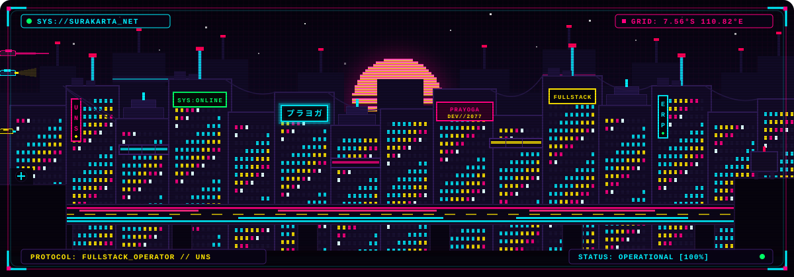

<div align="center">

<!-- Cyberpunk HUD Hero Banner -->


<br/><br/>

<!-- Handcrafted Cyberpunk Pixel Art City Metropolis -->


<br/>

<sub><strong>[ ⚡ CITY SIGNAL: SURAKARTA_NODE // 110.82°E 7.56°S ]</strong> &nbsp;·&nbsp; <i>clean architecture in a noisy metropolis</i></sub>

<br/><br/>

<!-- Cyber Quick Action Links -->
<p align="center">
  <a href="https://agoyeeee-portfolio.vercel.app/" target="_blank">
    
  </a>
  &nbsp;
  <a href="mailto:prayogaputra70@gmail.com">
    
  </a>
  &nbsp;
  <a href="https://linkedin.com/in/prayogaputra" target="_blank">
    
  </a>
  &nbsp;
  <a href="https://github.com/agoyeeee" target="_blank">
    
  </a>
</p>

<p align="center">
  
</p>

</div>

<br/>


<br/>

## 📡 Operator Dossier

```yaml
OPERATOR     : Prayoga Putra [agoyeeee]
ROLE         : Full-Stack Developer & System Architect
CAMPUS       : Informatics Engineering @ Universitas Sebelas Maret (UNS)
LOCATION     : Surakarta, Central Java, Indonesia 🇮🇩 [7.56°S, 110.82°E]
CORE_DOMAIN  : Enterprise ERPs, Purchasing & Inventory, High-Performance Backends
PHILOSOPHY   : "Readable architecture, dependable behavior, and measurable performance."
STATUS       : [SYS_ONLINE // READY_TO_DEPLOY]
```

I’m **Prayoga Putra**, a Full-Stack Developer and Informatics Engineering student at **Universitas Sebelas Maret** in Surakarta, Indonesia.

I engineer software designed for complex, real-world business processes: **purchasing workflows, multi-warehouse inventory, raw material tracking, audit-proof transaction ledgers, and reactive web applications**. My default priorities are straightforward: **write clean code that is easy to comprehend, robust enough to survive heavy production workloads, and architected to scale effortlessly.**

- 🏢 **Enterprise Systems**: Architecting transactional business workflows, procurement, and inventory control.
- ⚙️ **Backend Engineering**: Structuring maintainable REST APIs, query optimization, and resilient database schemas.
- 🎨 **Modern Frontend Matrix**: Crafting snappy, responsive interfaces with Vue, React, Next.js, and TypeScript.
- 🐳 **DevOps Infrastructure**: Containerizing reproducible dev/prod environments with Docker and Linux servers.

<br/>


<br/>

<!-- Tech Stack HUD -->
<div align="center">
  
</div>

<br/>


<br/>

<!-- Currently Building HUD -->
<div align="center">
  
</div>

<br/>


<br/>

## 🛠️ Core Engineering Modules

<table width="100%">
<tr>
<td width="33%" valign="top">

### 🏢 Enterprise Systems
- End-to-end **Purchasing & Procurement**
- Multi-location **Warehouse & Inventory**
- Raw material tracking & approval chains
- ACID-safe transaction ledgers & audit trails

</td>
<td width="33%" valign="top">

### ⚡ Full-Stack Matrix
- **Laravel & PHP** core backend services
- **Vue.js & Inertia.js** reactive SPA workflows
- **React.js & Next.js** modern product interfaces
- **TypeScript & Tailwind CSS** type-safe UI

</td>
<td width="33%" valign="top">

### ⚙️ DevOps & Quality
- **PostgreSQL & MySQL** query index tuning
- **Redis** caching & high-speed data buffers
- **Docker** multi-service container orchestration
- **Linux** server provisioning & Git automation

</td>
</tr>
</table>

<br/>


<br/>

<!-- Featured Projects HUD -->
<div align="center">
  

  <br/>

  <p align="center">
    <a href="https://agoyeeee-portfolio.vercel.app/" target="_blank"><b>🌐 Digital Portfolio 2.0</b></a>
    &nbsp;&nbsp;·&nbsp;&nbsp;
    <a href="https://github.com/agoyeeee/obat" target="_blank"><b>💊 Pharmacy Management System</b></a>
    &nbsp;&nbsp;·&nbsp;&nbsp;
    <a href="https://github.com/agoyeeee/SistemFinalProject" target="_blank"><b>🎓 Final Project System</b></a>
    &nbsp;&nbsp;·&nbsp;&nbsp;
    <a href="https://github.com/agoyeeee/provider" target="_blank"><b>📊 Provider Dashboard</b></a>
  </p>
</div>

<br/>


<br/>

## 📊 Telemetry & Matrix Activity

<div align="center">

<table width="100%" border="0">
<tr>
<td width="50%">
  
</td>
<td width="50%">
  
</td>
</tr>
</table>

<br/>


<br/><br/>


</div>

<br/>


<br/>

<div align="center">

> **`"Good software should stay understandable, survive production, and make the next change easier."`**

<br/>

<p align="center">
  <a href="https://agoyeeee-portfolio.vercel.app/" target="_blank">🌐 <b>Portfolio</b></a>
  &nbsp;&nbsp;·&nbsp;&nbsp;
  <a href="mailto:prayogaputra70@gmail.com">✉️ <b>prayogaputra70@gmail.com</b></a>
  &nbsp;&nbsp;·&nbsp;&nbsp;
  <a href="https://linkedin.com/in/prayogaputra" target="_blank">💼 <b>LinkedIn</b></a>
  &nbsp;&nbsp;·&nbsp;&nbsp;
  <a href="https://github.com/agoyeeee" target="_blank">🐙 <b>GitHub</b></a>
</p>

<br/>

<sub><code>[ END OF TRANSMISSION // 2077 // OPERATOR: PRAYOGA PUTRA ]</code></sub>

</div>
