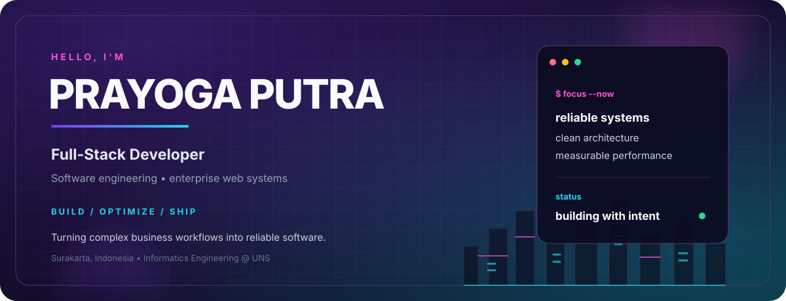
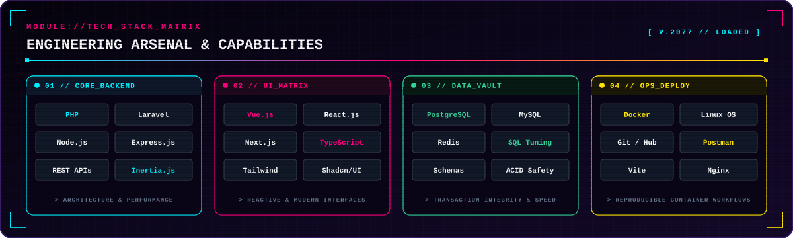
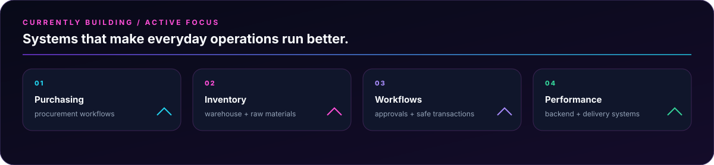
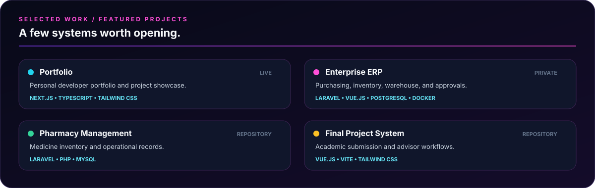

 

<strong>NEON CITY SIGNAL</strong> &nbsp;·&nbsp; clean systems in a noisy city

 

<a href="https://agoyeeee-portfolio.vercel.app/">Portfolio</a>
&nbsp;&nbsp;·&nbsp;&nbsp;
<a href="mailto:prayogaputra70@gmail.com">Email</a>
&nbsp;&nbsp;·&nbsp;&nbsp;
<a href="https://linkedin.com/in/prayogaputra">LinkedIn</a>
&nbsp;&nbsp;·&nbsp;&nbsp;
<a href="https://github.com/agoyeeee">GitHub</a>

 

 

## Operator profile

I’m **Prayoga Putra**, a Full-Stack Developer and Informatics Engineering student at **Universitas Sebelas Maret** in Surakarta, Indonesia.

I build software for real business processes: purchasing, inventory, warehouse operations, approval workflows, transaction safety, and internal enterprise platforms. My default priorities are simple: **readable architecture, dependable behavior, and measurable performance**.

 

 

 

## Systems I build

<table width="100%">
<tr>
<td width="33%" valign="top">

**Enterprise systems** 
Purchasing, procurement, inventory, warehouse, and audit-friendly internal workflows.

</td>
<td width="33%" valign="top">

**Full-stack products** 
Laravel and REST APIs paired with Vue, React, Next.js, and reusable UI systems.

</td>
<td width="33%" valign="top">

**Engineering quality** 
Query optimization, transaction integrity, containerized development, and reliable delivery.

</td>
</tr>
</table>

 

 

<a href="https://agoyeeee-portfolio.vercel.app/">Portfolio</a>
&nbsp;&nbsp;·&nbsp;&nbsp;
<a href="https://github.com/agoyeeee/obat">Pharmacy Management</a>
&nbsp;&nbsp;·&nbsp;&nbsp;
<a href="https://github.com/agoyeeee/SistemFinalProject">Final Project System</a>

 

## GitHub telemetry

<table width="100%">
<tr>
<td width="50%">

</td>
<td width="50%">

</td>
</tr>
</table>

 

 

> **Good software should stay understandable, survive production, and make the next change easier.**

 

<a href="https://agoyeeee-portfolio.vercel.app/">Portfolio</a>
&nbsp;&nbsp;·&nbsp;&nbsp;
<a href="mailto:prayogaputra70@gmail.com">prayogaputra70@gmail.com</a>
&nbsp;&nbsp;·&nbsp;&nbsp;
<a href="https://linkedin.com/in/prayogaputra">linkedin.com/in/prayogaputra</a>

 

City artwork: <a href="https://commons.wikimedia.org/wiki/File:Cyberpunk_city_created_by_Stable_Diffusion.webp">Wikimedia Commons</a> · CC0

