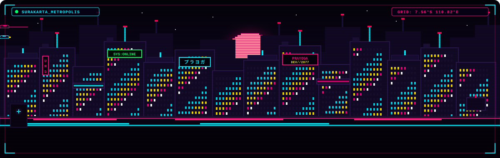
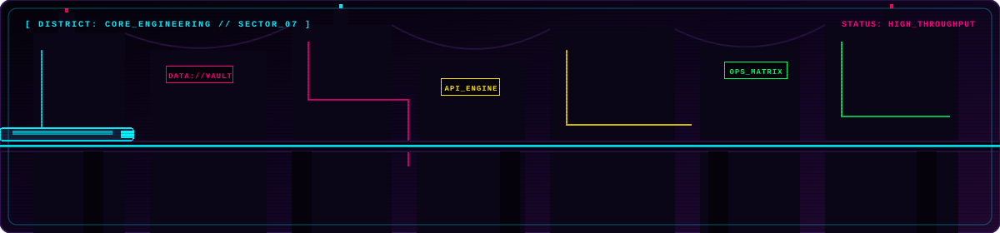
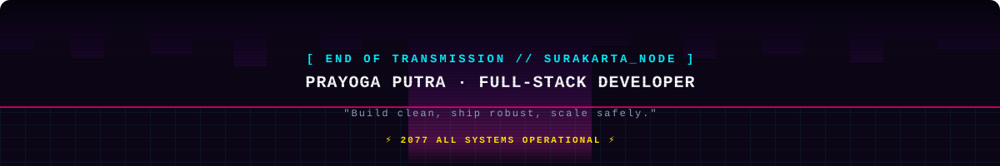

<div align="center">

<!-- Cyberpunk Pixel Metropolis Hero Banner (Variation 1: Skyline & Sliced Sun) -->


<br/>

<!-- Dynamic Neon Typewriter SVG Banner -->
<a href="https://github.com/agoyeeee">
  
</a>

<br/><br/>

<!-- Quick Comm-Links -->
<p align="center">
  <a href="https://agoyeeee-portfolio.vercel.app/" target="_blank">
    
  </a>
  &nbsp;
  <a href="mailto:prayogaputra70@gmail.com">
    
  </a>
  &nbsp;
  <a href="https://linkedin.com/in/prayogaputra" target="_blank">
    
  </a>
  &nbsp;
  <a href="https://github.com/agoyeeee" target="_blank">
    
  </a>
</p>

<!-- Live Telemetry Visitor Badge -->
<p align="center">
  
</p>

</div>

<br/>


<br/>

## 📡 Operator Dossier

```yaml
OPERATOR     : Prayoga Putra [agoyeeee]
ROLE         : Full-Stack Developer & System Architect
EDUCATION    : Informatics Engineering @ Universitas Sebelas Maret (UNS)
LOCATION     : Surakarta, Central Java, Indonesia 🇮🇩 [7.56°S, 110.82°E]
SPECIALIZATION: Enterprise Purchasing & Inventory ERP, Transactional Backends
PHILOSOPHY   : "Code that is easy to read, robust to run, and built to scale."
STATUS       : [SYS_ONLINE // READY_TO_DEPLOY]
```

I’m **Prayoga Putra**, a Full-Stack Developer and Informatics Engineering student at **Universitas Sebelas Maret** in Surakarta, Indonesia.

I engineer data-driven web software for real-world enterprise processes: **purchasing workflows, multi-warehouse inventory control, raw material tracking, ACID-safe transaction ledgers, and reactive frontends**. My standard is simple: **readable architecture, dependable behavior in heavy production, and measurable performance.**

- 🏢 **Enterprise Systems**: Architecting automated procurement, inventory matrices, and audit trails.
- ⚙️ **Backend Core**: Structuring clean REST APIs, query optimization, and resilient PostgreSQL/MySQL schemas.
- 🎨 **Modern Frontend**: Building high-speed, interactive user interfaces with Vue, React, Next.js, and TypeScript.
- 🐳 **DevOps Infrastructure**: Containerizing reproducible environments with Docker and Linux servers.

<br/>


<br/>

## 🛠️ Dynamic Tech Matrix & Arsenal

<div align="center">
  <!-- Dynamic Skill Icons Grid -->
  <a href="https://skillicons.dev">
    
  </a>
</div>

<br/>

<table width="100%">
<tr>
<td width="50%" valign="top">

#### `[ 01 // CORE_BACKEND ]`
- **Languages**: `PHP`, `TypeScript`, `JavaScript`, `SQL`
- **Frameworks**: `Laravel`, `Node.js`, `Express.js`
- **Protocols**: `RESTful APIs`, `Inertia.js`, `JWT / Sanctum`

#### `[ 02 // UI_MATRIX ]`
- **Frameworks**: `Vue.js`, `React.js`, `Next.js`
- **Styling**: `Tailwind CSS`, `Bootstrap`, `Shadcn UI`
- **Tooling**: `Vite`, `HTML5`, `CSS3 / PostCSS`

</td>
<td width="50%" valign="top">

#### `[ 03 // DATA_VAULT ]`
- **Databases**: `PostgreSQL`, `MySQL`, `Redis`
- **Optimization**: `Indexing`, `ACID Transactions`, `Query Tuning`
- **Design**: `Relational Schemas`, `Audit Ledgers`

#### `[ 04 // OPS_DEPLOY ]`
- **Containers**: `Docker`, `Docker Compose`
- **Environment**: `Linux (Ubuntu/Debian)`, `Nginx`, `Vercel`
- **Version Control**: `Git`, `GitHub Actions`, `Postman`

</td>
</tr>
</table>

<br/>


<br/>

<!-- Cyberpunk Industrial District Banner (Variation 2: Monorail & Cyber Highway) -->
<div align="center">
  
</div>

<br/>

## 🌟 Databank: Deployed Systems & Projects

<table width="100%">
  <thead>
    <tr>
      <th align="left">System / Project</th>
      <th align="left">Description</th>
      <th align="left">Stack</th>
      <th align="center">Status</th>
    </tr>
  </thead>
  <tbody>
    <tr>
      <td><b>🌐 <a href="https://agoyeeee-portfolio.vercel.app/" target="_blank">Digital Portfolio 2.0</a></b></td>
      <td>Interactive personal developer showcase with animations and project telemetry.</td>
      <td><code>Next.js</code> <code>TypeScript</code> <code>Tailwind</code></td>
      <td align="center"></td>
    </tr>
    <tr>
      <td><b>🏢 Enterprise ERP System</b></td>
      <td>Comprehensive Purchasing, Raw Material Request & Warehouse Inventory ERP.</td>
      <td><code>Laravel</code> <code>PostgreSQL</code> <code>Vue.js</code> <code>Docker</code></td>
      <td align="center"></td>
    </tr>
    <tr>
      <td><b>💊 <a href="https://github.com/agoyeeee/obat" target="_blank">Sistem Manajemen Obat</a></b></td>
      <td>Pharmacy stock control, prescription management, and transactional logs.</td>
      <td><code>PHP</code> <code>Laravel</code> <code>MySQL</code> <code>Bootstrap</code></td>
      <td align="center"></td>
    </tr>
    <tr>
      <td><b>🎓 <a href="https://github.com/agoyeeee/SistemFinalProject" target="_blank">Sistem Final Project</a></b></td>
      <td>Academic milestone tracking and advisor submission platform for universities.</td>
      <td><code>Vue.js</code> <code>Vite</code> <code>Tailwind CSS</code></td>
      <td align="center"></td>
    </tr>
    <tr>
      <td><b>📊 <a href="https://github.com/agoyeeee/provider" target="_blank">Provider & Admin Dashboard</a></b></td>
      <td>Modular administration portal with real-time operational metrics & providers.</td>
      <td><code>Vue.js</code> <code>REST API</code> <code>Component UI</code></td>
      <td align="center"></td>
    </tr>
  </tbody>
</table>

<br/>


<br/>

## 📊 Live GitHub Telemetry

<div align="center">

<table width="100%" border="0">
<tr>
<td width="50%">
  
</td>
<td width="50%">
  
</td>
</tr>
</table>

<br/>


<br/><br/>


<br/><br/>

<!-- Dynamic Dev Quote Widget with Cyberpunk Colors -->


</div>

<br/>


<br/>

<!-- Cyberpunk Dawn Horizon Footer (Variation 3: Synthwave Grid Horizon & Signature) -->
<div align="center">
  
  
  <br/><br/>

  <p align="center">
    <a href="https://agoyeeee-portfolio.vercel.app/" target="_blank">🌐 <b>Portfolio</b></a>
    &nbsp;&nbsp;·&nbsp;&nbsp;
    <a href="mailto:prayogaputra70@gmail.com">✉️ <b>prayogaputra70@gmail.com</b></a>
    &nbsp;&nbsp;·&nbsp;&nbsp;
    <a href="https://linkedin.com/in/prayogaputra" target="_blank">💼 <b>LinkedIn</b></a>
    &nbsp;&nbsp;·&nbsp;&nbsp;
    <a href="https://github.com/agoyeeee" target="_blank">🐙 <b>GitHub</b></a>
  </p>
</div>
